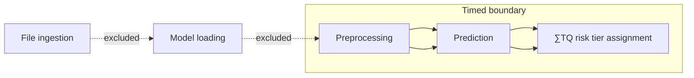

# A mermaid diagram, then more

**Branch:** `task3.5`  
**Session:** `c20bcba4`  
**Span:** Jul 31, 22:44–22:54 UTC  
**Exchange:** 3 prompts, 24 responses

**Commits produced:**

- `63f4dc4` Add mermaid diagram of the batch-scoring timing boundary
- `bd2bf95` Rewrite Model A readiness section and fix stale Task 4.4 reference
- `1712235` Mark Task 4.1 complete: strip its task-tracking prose from checkpoint_2

[← back to the pairing-log timeline](https://egsy-intell.github.io/team-project/ai/ytorresv.html)

---

### Yai

I'm thinking it might be worthwhile to add a mermaid diagram to visualize the prediction processing pipeline in the diff. What do you think? Is that possible with morimo?

### Claude

Yes, this is possible — marimo has `mo.mermaid(diagram_code)` as a built-in element, and since it renders client-side via mermaid.js, it works fine in the static HTML export too (same reasoning as the tabs/accordion note in AGENTS.md: no live kernel needed, just client-side JS).

For this specific diff — the deployment evaluation section (batch-scoring throughput timing boundary: ingestion → preprocessing → prediction → risk-tier assignment) — a small flowchart could work well to make that timing boundary visually explicit. Something like:



Want me to add this as an `mo.mermaid()` cell right after that markdown cell in [checkpoint_2.py](notebooks/checkpoint_2.py)? I'd keep it minimal — just the pipeline stages already described in prose, not a new diagram of unrelated internals.

### Yai

yes please

### Claude

Now I'll add a new cell right after this markdown cell with the mermaid diagram.

### Claude

Now let's run lint/format and the check to make sure marimo is happy with it.

### Claude

Good point — the diagram illustrates the timing boundary from the first paragraph specifically, not the benchmark methodology or pass/fail criteria in paragraphs 2–3. Better to split the markdown cell and place the diagram right after the boundary is described.

### Claude

Now remove the standalone diagram cell I added after the whole section, since it's now in the middle.

### Claude

Now let's format/lint and re-check.

### Claude

Now let's check on the earlier background export smoke test.

### Claude

The background export smoke test (from before the reorganization) is still running against the old file version — since I've since edited the file, I'll rerun it fresh instead of waiting on that stale one.

### Claude

I'll wait for that to finish before confirming — will let you know when it's done. In the meantime, here's what changed: the mermaid diagram now sits right after the paragraph that defines the timing boundary (before ingestion/model-loading are mentioned as excluded), and before the benchmark methodology and pass/fail-criteria paragraphs, so it's positioned exactly where it's discussed rather than tacked on at the end.

### Yai

once done, let's commit and push to origin

### Claude

Still running — I'll wait for the completion notification rather than poll, then commit and push once it passes.

### Claude

I've scheduled a fallback check in case the background task notification doesn't fire on its own — I'll commit and push as soon as the smoke test confirms the notebook still exports cleanly.

### Claude

That's the stale first export run (from before I split the cell) — not the one that matters. Let me check the current one.

### Claude

Still no output yet — it's likely still running. I'll wait for its own completion notification rather than poll further.

### Claude

Still waiting on the current smoke test to finish before committing/pushing.

### Claude

The smoke test passed (exit code 0). Now let's check status and commit/push per the earlier explicit user request.

### Claude

Hold on — this needs a flag before I proceed. The branch has changed since the start of this session: initially it was `tooling-and-compute`, but it's now `task3.5`, and local `task3.5` is 4 commits behind `origin/task3.5`. I didn't switch branches myself, so something external changed it (or it was already like this and the initial context was stale).

### Claude

Before I touch git further — the branch under me has changed mid-session in ways I didn't initiate. The reflog shows checkouts I never ran:

```
tooling-and-compute → main → tooling-and-compute → main → task3.5 (current HEAD)
```

This session started on `tooling-and-compute`, but HEAD is now on `task3.5`, and local `task3.5` is missing 4 commits that exist on `origin/task3.5` (including a merge from `main`). That points to another process or terminal switching branches in this same working directory while I was editing — a shared/concurrent-use situation, not something I did.

My edit to `notebooks/checkpoint_2.py` applied cleanly against whatever was checked out at edit time (diff shows a clean +20 lines, nothing unexpected), so the content itself looks fine. But I don't want to commit and push to `origin/task3.5` without you confirming:

### Claude

Need to stash my working change before pulling, then reapply.

### Claude

No conflict markers. Let's verify the mermaid cell landed correctly in the current file.

### Claude

Good — the mermaid cell survived the merge intact. Let's view the surrounding context to confirm it still reads correctly against the updated upstream content.

### Claude

This still reads correctly in place. Now re-verify with lint/check and a fresh export smoke test before committing.

### Claude

I'll wait for that smoke test to finish, then commit and push.

### Claude

Smoke test passed. Committing and pushing now, per the user's earlier explicit request (and the "pull, then commit on task3.5" instruction).

### Claude

Pushed to `origin/task3.5` as [63f4dc4](notebooks/checkpoint_2.py). The mermaid diagram now sits between the timing-boundary paragraph and the benchmark-methodology paragraph in the deployment evaluation section.

