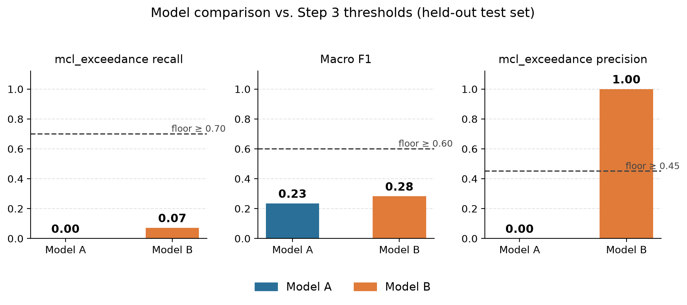
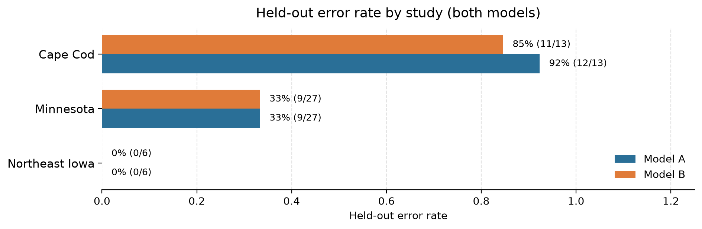

# Picking Up From Check-In #2

::: notes
[Speaker: Yai] Hi again — Team .egsy intelligence, Group 14. You saw our problem, our data, and our evaluation plan at Check-In #2, so we won't re-walk that ground. One thing before we dive in: our peer reviewers told us the last deck covered too much technical detail, and asked us to lead with results instead. We took that seriously — this is a shorter, results-first deck, and it's the first of three peer-review items we've folded in. Fifteen minutes, four speakers, one question: did our two models actually work?
:::

## Where We Left Off

- **∑TQ risk tiers:** reduced monitoring (< 0.5) · trigger (0.5–1.0) · **MCL exceedance (≥ 1.0)**
- **Two competing proposals:** Model A (logistic regression) vs. Model B (random forest)
- **Study-grouped split:** 190 training sites / 46 held-out sites, 3 entirely unseen studies

::: notes
[Speaker: Yai] Quick anchor, not a re-teach: sites get scored into one of three PFAS risk tiers by summed toxicity quotient, we proposed two competing classifiers, and we evaluate both on whole studies neither model trained on — Cape Cod, Minnesota, and Northeast Iowa — so the test is honest about generalizing to new places, not just new rows.
:::

## Team & Roles — Step 5

| Task | Owner(s) |
|---|---|
| T5 — Build & tune Model A (baseline) | Raj |
| T6 — Build & tune Model B (ensemble) | Emir |
| T7 — Run predictions & evaluate | Yai, Somya |
| T9 — Model validation & benchmarking | Yai, Somya |
| T10 — Deployment & lessons-learned narrative | Emir, Yai |
| T11 — Finalize public repo | Yai, Raj |

::: notes
[Speaker: Yai] Step 5 split into six pieces. Raj built and tuned Model A; Emir did the same for Model B — you'll hear each of them walk their own model shortly. Somya and I jointly ran both against the held-out studies and benchmarked them. Emir and I turned that into the deployment discussion. Raj and I finalized the public repo. Everyone owns at least two pieces of Steps 3 through 5, as the spec asks.
:::

## Peer Feedback We're Integrating

- **"Simplify, lead with results"** → shapes this entire deck
- **Quantify site sparsity** → coming up in Somya's section
- **Is national scope right for this data?** → coming up in Emir's section

::: notes
[Speaker: Yai] The spec requires we name at least one peer-review item we integrated, and say where. We're naming three. You already saw the first — this deck's whole shape is a response to it. The other two are substantive, not cosmetic: one reviewer wanted us to actually quantify how sparse our site data is, and another doubted whether a national model is well matched to data this thin, suggesting a regional focus instead. Both show up later with real numbers, not just an acknowledgment. Raj, take us into how the models were built.
:::

# Step 5: Building & Tuning the Two Models

::: notes
[Speaker: Raj] Thanks, Yai. Both models trained on the exact same 190 sites, the same 27 land-use predictors, and the same grouped cross-validation folds, so any difference between them comes from the classifier, not the data prep. Grouping by whole study means an entire study moves together into either the fitting or validation side of a fold, which is a stricter, more honest test than a random row-level split would be — it forces each model to prove it generalizes to places it hasn't seen, not just rows it hasn't seen. One practical wrinkle from that: a State or Site Type that only shows up in one or two studies can be entirely absent from a fold's fitting data. We audited every fold for that ahead of time and built the preprocessing to handle it safely rather than let it break tuning silently.
:::

## Model A: Interpretable Baseline

- Multinomial logistic regression, L2-regularized, grouped 5-fold CV
- Selected: **C = 10, unweighted classes**
- CV macro F1 **0.37**, CV `mcl_exceedance` recall **0.41** (best candidate reached 0.52)
- Biggest coefficients: mostly **State** indicators, not land-use features

::: notes
[Speaker: Raj] Grid search picked C=10 with no class weighting — grouped cross-validation preferred that over the "balanced" setting we'd planned in Step 4. On training data it reached 0.37 macro F1, and its best recall on the high-risk tier across the whole grid was 0.52 — already below our 0.70 floor before it ever saw a held-out site, which matters for what's coming. On interpretability, the model does mostly what we wanted: distance to the nearest PFAS site and nearby facility counts point the direction you'd expect, more sites and closer proximity raise risk, and so does nearby developed land. Two urban-burn variables ran the opposite direction from what we expected, a reminder that these are associations pulled from correlated predictors, not causal effects. More strikingly, six of the eight largest coefficients turned out to be State indicators, not land-use variables at all — geography is doing more of the work than our actual predictors are, which is a preview of a limitation Somya's going to quantify directly in a few minutes. That kind of check — actually being able to open the hood and see what's driving a prediction — is exactly what we designed Model A to give us, even before we knew how the held-out results would look. It's also worth saying what didn't change: this is the same allowlisted predictor set, the same grouped folds, and the same imputation approach we proposed back at Check-In #2 — no last-minute redesign, just running the plan we already committed to. Over to Emir for Model B.
:::

## Model B: Random Forest Ensemble

- 100 trees, max depth 10, min leaf size 1
- CV macro F1 **0.31**, CV `mcl_exceedance` recall **0.33**
- Built to capture non-linear land-use interactions Model A's straight lines can't
- Also well short of the 0.70 recall floor during tuning

::: notes
[Speaker: Emir] The ensemble landed on 100 trees, depth capped at 10. It's meant to catch interactions Raj's linear model structurally can't — say, a facility's distance mattering differently in a dense urban tract than a rural one. In training, it actually scored a bit lower than Model A on both macro F1 and high-risk recall. So going into the held-out test, neither model looked like a clear favorite, and neither was close to our bar. Somya's going to show you what happened when we actually ran them.
:::

# Step 5: What Did the Held-Out Studies Show?

::: notes
[Speaker: Somya] Thanks, Emir. Here's the part of this deck that matters most: not what each model was tuned to do, but what happened when Yai and I actually pointed both of them at studies they'd never seen.
:::

## Neither Model Clears the Bar

::: notes
[Speaker: Somya] Against the same three floors we set at Check-In #2 — recall, macro F1, precision — both models fail on the metric we care about most. Model A caught 0 of the 14 truly high-risk held-out sites; Model B caught 1 of 14. Put another way: Model A predicted "within reduced monitoring," our lowest-concern tier, for all 46 of the 46 held-out sites — the same call every time, regardless of what it saw. Model B did the same for 45 of 46, and its precision bar looks perfect at 1.00, but that's a single correct positive prediction out of 46 sites — flip that one prediction and it's zero. We don't treat it as a reliable pattern. And this wasn't a held-out-set surprise: Raj and Emir just showed you both models' best cross-validated recall already sat at 0.52 and 0.33 during tuning — well under the floor before either model saw an unseen study.
:::

## Where the Errors Concentrate

::: notes
[Speaker: Somya] Errors aren't spread evenly. Cape Cod's 13 test sites are overwhelmingly high-risk — 9 of 13 hit MCL exceedance — and both models miss almost all of them: 92% error for Model A, 85% for Model B. Minnesota, a more mixed study, sits at 33% for both. Northeast Iowa shows 0% error, but only because every one of its 6 sites is already low-risk — a model that always guesses the majority tier gets Iowa right for free without distinguishing anything. The pattern isn't "this model struggles with this region" — it's "both models default to the majority tier, and the error rate just tracks how far each study's true mix departs from that default."
:::

## How Sparse Is Our Data, Really?

- **236** combined sites across **36** states and territories
- **9** states represented by a **single site**
- Top 3 states (Illinois, Minnesota, California) = **35.6%** of everything we have
- The 15 sparsest states average **1.5 sites each**

::: notes
[Speaker: Somya] This is the peer-feedback item we promised to quantify, and the real number is starker than the roughly five-sites-per-state estimate floated in review — it's 1.5. Our combined training and held-out pool covers 236 sites, but they're spread thin and unevenly: 36 states and territories total, 9 of them down to a single site, and just three states supplying over a third of everything we have. We checked, and the errors we just showed you line up with each held-out study's actual risk mix, not with which state it's in — but with coverage this thin, we can't fully separate the two. That skew, not weak tuning, is the binding constraint on how well either model can generalize geographically. Emir will take it from here on what that means for deployment.
:::

# Deployment, Lessons Learned & What's Next

::: notes
[Speaker: Emir] Thanks, Somya. Given all of that, where does this leave the project?
:::

## Is This Ready to Deploy?

- **No.** Neither model meets the recall floor that matters most operationally
- We'd retain **Model A** as the stronger prototype — simpler, easier to inspect
- Model B's one-site edge doesn't justify its added complexity

::: notes
[Speaker: Emir] Neither model is ready for operators to act on. A model that predicts the majority tier by default risks doing exactly the opposite of what a screening tool should: deprioritizing sites that actually need confirmatory sampling. Even a working version of this tool would still need a water-quality specialist reviewing its predictions before any site is excluded from testing — the model was always meant to inform sampling priorities, not replace them. Between our two models, we'd carry Model A forward as the better starting point for future work — not because it performed better today, it barely did, but because its behavior is easier to inspect and improve as the underlying data gets better. That's a development preference, not a safety claim.
:::

## Lessons Learned & the Regional Question

- CV recall (0.41–0.52) did not survive contact with unseen studies (0.00–0.07)
- A data-volume and geographic-coverage ceiling — not a modeling problem
- Peer review asked: is a **national** model well matched to data this thin?
- McMahon et al. (2022)'s regional approach (5 eastern aquifers) reached **0.96 sensitivity / 0.72 specificity**

::: notes
[Speaker: Emir] The headline lesson: performance inside our available studies did not predict performance on studies we'd never seen, and that gap didn't budge from hyperparameter tuning — we checked. No amount of grid search fixes a model that's only ever seen a few hundred sites clustered in a handful of states. Which brings us to the second peer-feedback item: a reviewer suggested our national scope might be too ambitious for data this sparse, and that a single-state or regional model would control for geography more precisely. We can't run a controlled test of that in the time we had, different target, different predictor set, but McMahon's own study is a real data point in that direction — five eastern aquifer systems instead of a national sample, and sensitivity and specificity well above anything either of our national models produced, even during cross-validation. We're taking that seriously as our next step, not just noting it.
:::

## Our Recommendation

- Treat this as an **exploratory research prototype**, not a screening-ready tool
- Priority #1: **scale up site sampling** in underrepresented states and regions
- Add predictors with independent evidence of value (e.g., DOC, VOC measurements)
- Re-evaluate on **entirely unseen regions** before reconsidering deployment

::: notes
[Speaker: Emir] So: not deployment-ready, and more tuning isn't the fix. The highest-leverage next step is data, not modeling — denser, more geographically representative site sampling, ideally paired with predictors like dissolved organic carbon or VOCs that other PFAS groundwater work found useful. Only once that gap closes, and a model consistently meets our recall floor on regions it's never touched, would we revisit deployment. Yai, back to you to close us out.
:::

# Wrap-Up

::: notes
[Speaker: Yai] Thanks, Emir. Before we close, one more piece of Step 5 housekeeping.
:::

## Public Codebase

- **github.com/egsy-intell/team-project** — public, no request access needed
- Full pipeline: data prep → ∑TQ scoring → Model A/B training → held-out evaluation

::: notes
[Speaker: Yai] Raj and I own this one together: the full codebase behind everything you've just seen is public at github.com/egsy-intell/team-project, the same link that's in the written report. Every step is in there and runnable end to end — data cleaning, the ∑TQ pipeline, both models' training and tuning, and this held-out evaluation — so nothing we've shown you today is a one-off notebook run; anyone can clone it, rerun it, and land on the same 0.00 and 0.07 recall numbers Somya showed you.
:::

## References

| Source | Note |
|---|---|
| McMahon et al. (2022) | PFAS in Eastern U.S. groundwater — the regional comparison point. *Env. Sci. & Technology*. |
| Seawolf et al. (2023) | *PFAS reconnaissance landscape data* [Dataset]. USGS. |
| Smalling et al. (2023) | PFAS in U.S. tapwater — our target data. *Environment International*. |
| U.S. EPA (2024) | PFAS national primary drinking water regulation. |

::: notes
[Speaker: Yai] These are the four sources this deck itself draws on; full citations are in the written report.
:::

## Thank You

**Team .egsy intelligence** — Emir Beg · Gulshan Raj Shetty · Somyaranjan Sahu · Yaisiel Torres

Special thanks to our Check-In #2 peer reviewers: **Sky Alexander, Sereyroath So, Gavin Thompson, and Radman Zarbock** — your review was fair and thorough, and shaped this presentation directly.

Thanks again for reviewing our work — we truly appreciate your time and interest.

::: notes
[Speaker: Yai] That's Step 5: two models built and tuned, an honest held-out result that neither cleared our bar, a data-sparsity limitation we quantified rather than guessed at, and a recommendation to fix the data before we chase the models further. Before we take questions, real thanks to Sky Alexander, Sereyroath So, Gavin Thompson, and Radman Zarbock for reviewing us at Check-In #2 — the feedback was fair, specific, and genuinely shaped what you saw today. Thanks again for reviewing our work — we truly appreciate your time and interest. Thanks for listening.
:::
